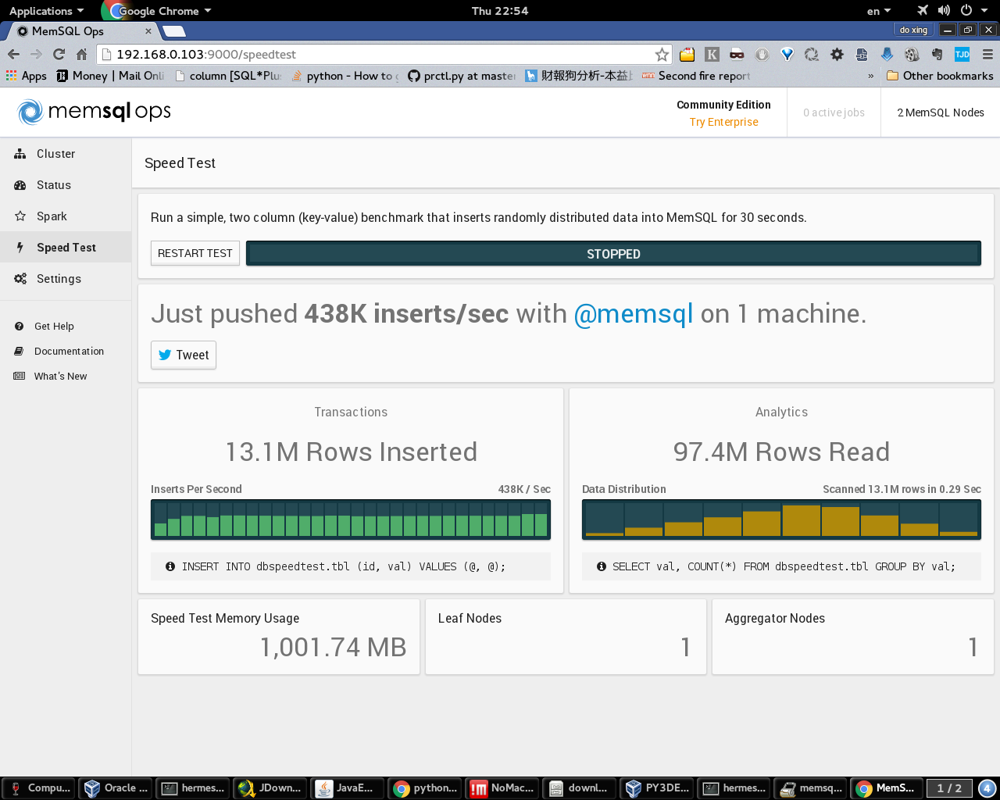

# Python 3 With NewSQL


##install Mem SQL 

```
#core need 4cores
#Disk need 24G
cd 
```


```
root@py3dev1:/home/hermes/memsql-ops-4.1.10# ./install.sh 
root@py3dev1:/home/hermes/memsql-ops-4.1.10# ./install.sh 
Installing MemSQL Ops in /var/lib/memsql-ops
Creating a memsql user
Setting up permissions
Creating an init script so that MemSQL Ops runs on startup
Creating a symlink to MemSQL Ops at /usr/bin/memsql-ops

Successfully installed MemSQL Ops!

--------------------------------------------------------------------------------

You can install MemSQL across multiple machines
using the MemSQL Ops Web UI.

For quick testing, you can also install a simple MemSQL
deployment on this host.

Do you want to install MemSQL on this host only? [y/N] y
2016-01-14 05:49:02: J880d52 [INFO] Deploying MemSQL to 192.168.0.103:3307
2016-01-14 05:49:02: J6d564e [INFO] Deploying MemSQL to 192.168.0.103:3308
2016-01-14 05:52:52: J880d52 [INFO] Downloading MemSQL: 100.00%           
2016-01-14 05:52:52: J880d52 [INFO] Installing MemSQL
2016-01-14 05:52:53: J6d564e [INFO] Downloading MemSQL: 100.00%           
2016-01-14 05:52:53: J6d564e [INFO] Installing MemSQL
2016-01-14 05:52:58: J880d52 [INFO] Finishing MemSQL Install
2016-01-14 05:52:59: J6d564e [INFO] Finishing MemSQL Install
Waiting for MemSQL to start...

A MemSQL cluster is now deployed to your local host. Run the command
below to connect to MemSQL with the mysql client:

  $ mysql -u root -h 127.0.0.1 -P 3307 --prompt="memsql> "

You can setup, manage and monitor MemSQL with the MemSQL Ops
web UI on port 9000. Make sure that port 9000 is open in your
firewall or security group.
安裝後WEBUI 

```
###由於我是安裝Maraidb client , 在開發環境上
我改安裝Mariadb-client 
```
apt-get install -y libmysqlclient-dev
apt-get install -y mariadb-client-10.0
apt-get install -y python3-dev

```